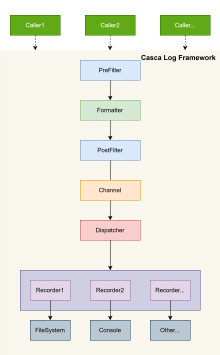

# Casca Log
Casca Log是一个纯C语言的日志框架，希望成为一个简单易用、扩展性好、功能丰富、性能优秀的跨平台的日志库。

Casca Log is a logging framework implemented purely in C, designed to be a simple, easy-to-use, highly extensible, feature-rich, high-performance, and cross-platform logging library.
## 框架简介
Casca Log的框架结构如下，划分为过滤器（Filter）、格式化器（Formatter）、日志通道（Channel）、分发器（Dispatcher）、记录器（Recorder）等模块。调用者（Caller）在打印日志时，首先会生成`clog_item_t`，包含日志的模块、目的地、级别、时间、内容等信息，然后调用`前向过滤器`进行过滤。经过`前向过滤器`后，会使用`格式化器`对日志进行格式化。在经过`后置过滤器`处理后，日志会被加入`通道`中，并向`分发器`发送日志到达事件。`分发器`从通道中读取日志并调用`记录器`进行记录。

The framework structure of `Casca Log` is organized into several core modules: Filter, Formatter, Channel, Dispatcher, and Recorder. When printing a log, the Caller first generates a clog_item_t structure containing metadata such as the log’s module, destination, level, timestamp, and content. This log item is then passed to the prefilter for preliminary filtering. After filtering, the log is formatted by the formatter, after processed by postfilter, it will be enqueued into the channel, and a log arrival event is dispatched to the dispatcher. Finally, the dispatcher retrieves the log from the channel and invokes the recorder to persist it.
